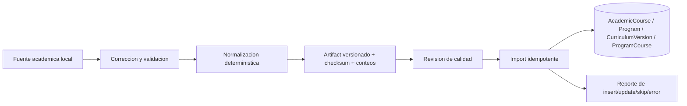

# Pipeline de catalogo academico v0

## Proposito

Definir la preparacion e importacion del catalogo institucional como proceso
offline reproducible, separado del runtime y del analisis IA de credenciales.

## Decision

El pipeline academico sera un proceso offline. Produce artifacts JSON
versionados y validados, con checksum y conteos; luego un importador idempotente
los aplica a PostgreSQL.

El artifact debe conservar version de schema, fecha de generacion, checksum de
entrada/salida y conteos esperados. La clave de idempotencia sigue las unique
keys reales del modelo, no coincidencias por nombre.

## Separacion de responsabilidades

- el pipeline limpia y transforma fuentes academicas;
- el importador aplica datos institucionales;
- NestJS runtime consulta catalogo ya importado;
- FastAPI analiza evidencias, no construye curriculas;
- el frontend nunca carga el dataset completo como autoridad.

## Alcance

- catalogo UADE/demo y futuras fuentes equivalentes;
- artifacts pequenos y versionados;
- validacion, checksum, conteos e idempotencia;
- reporte reproducible de importacion.

## Fuera de alcance

- servicio runtime o endpoint de importacion publico;
- scraping en cada request;
- mezclar catalogo con `semantic_analysis_v1`;
- inferir cursada/aprobacion del holder;
- jobs, scheduler o sincronizacion incremental productiva.

## Impacto en modulos actuales

Los scripts de importacion y modelos academicos actuales se conservan. Una
evolucion puede formalizar schemas de artifacts sin cambiar los endpoints de
busqueda curricular.

## Riesgos

- fuentes con sintaxis invalida;
- conteos incompletos o duplicados por key incorrecta;
- drift entre artifact y DB;
- ejecutar seed/import en ambiente equivocado;
- confundir catalogo ofrecido con logro completado.

## Proximos slices relacionados

Hardening del import offline y validacion de migracion/seed en P4f; no bloquea
P5 de analisis de evidencias.

