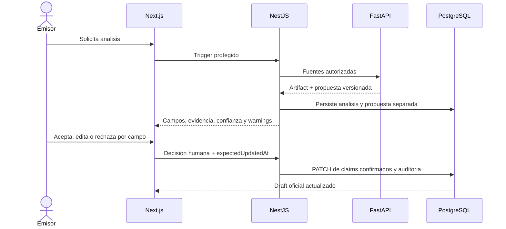

# Revision asistida por IA v0

## Proposito

Definir como convertir resultados IA en propuestas revisables sin permitir que
la IA modifique directamente los claims oficiales de una credencial.

## Decision

P5h introducira un contrato de propuesta y un modelo futuro
`CredentialEnrichmentProposal`. P6a permitira aceptar, editar o rechazar por
campo. Solo una accion humana autorizada podra ejecutar el PATCH normal del
draft.

## Reglas

- propuesta y `SemanticAnalysis` son entidades distintas;
- cada campo propuesto conserva evidencia, confianza y warnings;
- aceptar todo no debe ser el unico camino;
- una propuesta referencia draft, run y fuentes exactas;
- si draft o fuente cambian, la propuesta puede quedar stale;
- rechazo no elimina el artifact;
- ningun resultado modifica `Credential` automaticamente;
- valores confirmados pasan por validacion normal del tipo de credencial.

La revision no demuestra completion por si sola. Catalogos online siguen sin ser
prueba de finalizacion.

## Alcance

- propuestas separadas y revisables;
- decision humana por campo;
- CAS mediante `expectedUpdatedAt`;
- trazabilidad de quien y cuando reviso.

## Fuera de alcance

- schema/migracion o endpoint implementado;
- autocompletar y guardar sin confirmacion;
- canon_v2;
- readiness persistida;
- firma, emision o blockchain automatica.

## Impacto en modulos actuales

P5h afectara contratos IA, Prisma y lectura issuer-facing. P6a reutilizara el
servicio de actualizacion controlada del draft, sin bypass de permisos.

## Riesgos

- presentar IA como verdad;
- aceptar sobre un draft stale;
- perder evidencia por campo;
- mezclar respuesta cruda con propuesta oficial;
- hacer que readiness dependa de un resultado no revisado.

## Proximos slices relacionados

P5h propuestas, P6a revision, P6b readiness y ADR futura de `canon_v2`.

