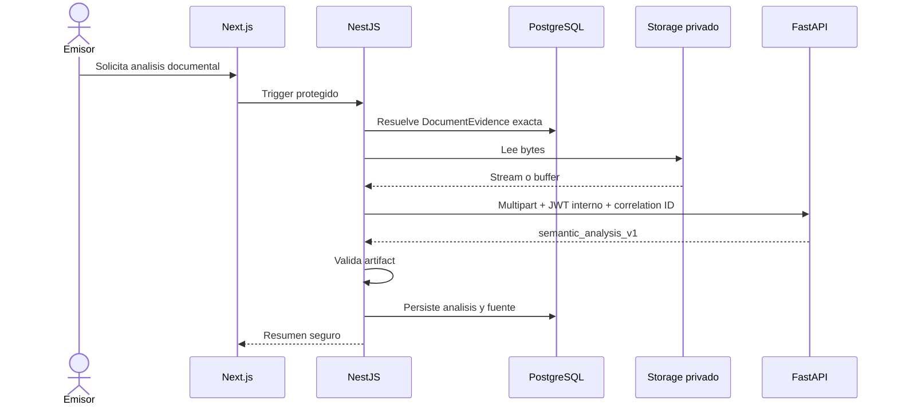
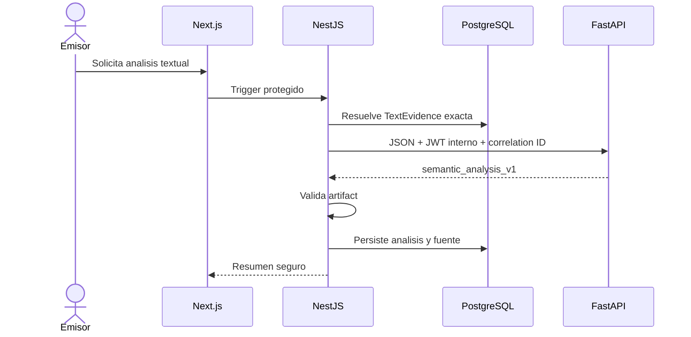
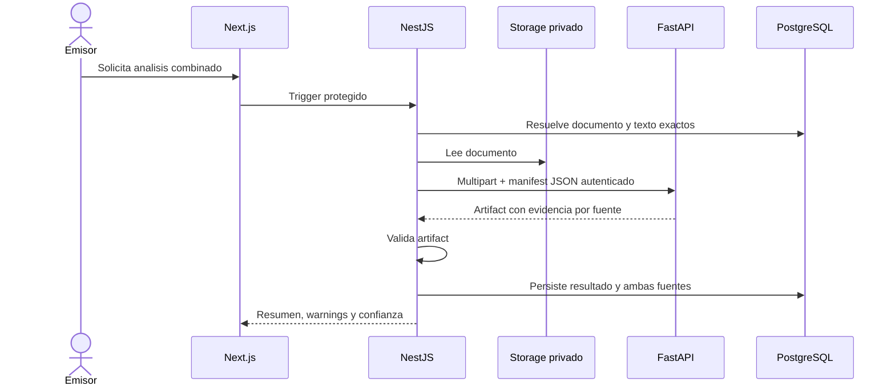

# Integracion con AI Service v1

## Proposito

Extender la arquitectura HTTP existente para analizar evidencia documental,
textual o combinada, preservando a NestJS como autoridad.

## Estado actual

Ya existen `AiServiceClient`, `AiIntegrationService`, validadores de
`semantic_analysis_v1` y `formative_profile_result_v0`, persistencia backend y
endpoints NestJS protegidos para PDF/perfil. FastAPI no persiste dominio ni
recibe identidad de usuario como autoridad.

P4i-3 implementa JWT interno HS256 entre NestJS y FastAPI. El token humano
termina en NestJS y nunca se reenvia: el cliente genera por request una
credencial de servicio nueva con `iss`, `aud`, `sub=traza-api`, `iat`, `exp` y
`jti`, sin PII ni permisos humanos.

P4i-6a registra el deployment demo como Web Service Free con URL HTTPS publica
y JWT interno. La red privada sigue siendo el objetivo; la excepcion no cambia
la frontera browser -> NestJS ni implementa las fuentes/lifecycle de P5.

P5a agrega resolucion persistente de `DocumentEvidence` y `TextEvidence`
current dentro de `AnalysisRunSource`. P5b ejecuta internamente solo runs
`document`: lee los bytes de la referencia exacta, llama FastAPI fuera de una
transaccion abierta, valida el artifact y persiste `SemanticAnalysis` con
`analysisRunId`. Los triggers HTTP y los modos `text`/`combined` siguen
planificados.

## Decision

- NestJS resuelve permisos y fuentes exactas;
- NestJS lee bytes del storage y los envia a FastAPI;
- texto viaja como JSON y documento como multipart binario;
- no se envia base64 en JSON;
- FastAPI devuelve artifacts versionados;
- NestJS vuelve a validar antes de persistir;
- el frontend nunca llama FastAPI.

## Analisis documental

## Analisis textual

## Analisis combinado

La forma definitiva de los endpoints se congelara en P5c-P5e. P5b no agrega
controller ni endpoint publico. No se
deben confundir con los endpoints actuales `/v1/semantic-analysis/pdf` y
`/v1/formative-profile/build`.

## Autenticacion y transporte

P4i-3 agrega dos modos emparejados: `none/disabled` para local y `jwt/jwt` para
demo o production. En modo JWT ambos procesos fallan al configurar si faltan
secreto, issuer o audience; NestJS tambien exige TTL valido de hasta 300
segundos y FastAPI valida clock skew entre 0 y 300 segundos. `/health` es
publico y los endpoints `/v1` quedan protegidos. La rotacion
`current/previous` y correlation IDs quedan pendientes. Los detalles viven en
`security-and-secrets-deployment-v0.md`. P4i-4 documenta Docker, direccion
interna, variables coordinadas, smoke y rollback en
`render-ai-private-service-runbook-v0.md`; no ejecuta el deploy ni cambia auth.

## Alcance

- documento, texto y combinado como modos separados;
- artifacts oficiales versionados;
- validacion doble y persistencia backend;
- entrega inicial de bytes por NestJS.

## Fuera de alcance

- llamada directa frontend-FastAPI;
- credenciales S3 en FastAPI;
- presigned URLs para P5 inicial;
- base64 en JSON;
- OCR obligatorio para PNG/JPEG;
- worker/cola y reanalisis automatico.

## Impacto en modulos actuales

Evoluciona `AiServiceClient`, `AiIntegrationService`, `document-evidence`,
`text-evidence` y `semantic`; no modifica `Credential` ni canonizacion de forma
automatica.

## Riesgos

- timeouts, memoria y payloads de hasta 20 MB;
- analizar una fuente reemplazada distinta;
- doble conteo en modo combinado;
- artifact incompatible o respuesta no JSON;
- registrar contenido, tokens o prompts en logs.

## Proximos slices relacionados

Migracion a red privada, P5c-P5e triggers y modos restantes, P5f
trazabilidad y tuning semantico medido en un slice separado.
