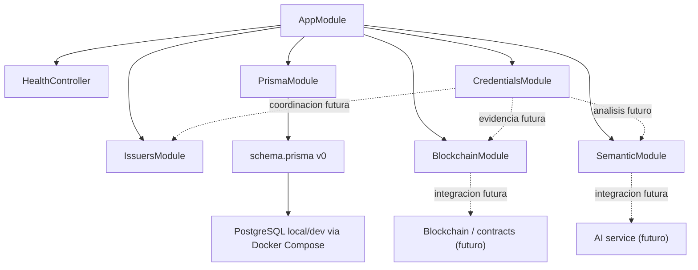

# Backend Current State v0

> Documento intermedio para seguimiento del estado actual del backend despues del scaffold tecnico inicial.

## 1. Estado actual del backend

`services/api` ya es un backend NestJS minimo ejecutable dentro del monorepo.

Estado validado:

- `GET /health` responde correctamente;
- Prisma tooling esta configurado;
- existe `PrismaModule` y `PrismaService`;
- existe `services/api/prisma/schema.prisma` como schema v0 del sistema;
- existen modulos iniciales de dominio;
- PostgreSQL local/dev fue levantado correctamente con Docker Compose;
- existe una migracion inicial aplicada localmente;
- existe un seed minimo reproducible ejecutado correctamente;
- el build del backend compila correctamente;
- `prisma validate` y `prisma generate` fueron ejecutados y validados.

Componentes tecnicos ya presentes:

- bootstrap NestJS en `services/api/src/main.ts`;
- `AppModule` con integracion de modulos base;
- `HealthController`;
- `PrismaModule` y `PrismaService`;
- package scripts para `dev`, `build`, `start`, `prisma:validate`, `prisma:format` y `prisma:generate`.

Alcance real de `GET /health`:

- confirma que NestJS arranca;
- confirma que el proceso responde HTTP;
- no confirma conexion real a PostgreSQL;
- no confirma que Prisma este ejecutando queries reales contra PostgreSQL en ese endpoint;
- no confirma disponibilidad del AI service;
- no confirma disponibilidad de blockchain o contratos;
- no reemplaza un futuro `readiness` o `health/deep`.

Estado local de persistencia ya validado por fuera de `GET /health`:

- PostgreSQL local/dev disponible mediante `infra/docker/docker-compose.postgres.yml`;
- migracion inicial aplicada en `services/api/prisma/migrations/20260709135135_init`;
- seed reproducible disponible en `services/api/prisma/seed.ts`;
- seed ejecutado correctamente con datos minimos de `Issuer`, `User` holder, `User` issuer admin e `IssuerMembership`.

## 2. Modelo de dominio persistente

El backend ya tiene un `schema.prisma` v0 orientado al sistema final y una primera migracion local aplicada para desarrollo.

Grupos principales del modelo:

- identidad y permisos: `User`, `Issuer`, `IssuerMembership`;
- credenciales: `Credential`;
- analisis semantico: `SemanticAnalysis`;
- perfil formativo: `FormativeProfile`;
- evidencia blockchain: `BlockchainRecord`;
- verificacion: `VerificationEvent`;
- sharing por links o QR: `SharingGrant`;
- catalogo academico y formativo: `AcademicCourse`, `ExternalCourse`, `Program`, `CurriculumVersion`, `ProgramCourse`;
- auditoria: `AuditLog`.

Ideas principales del modelo:

- PostgreSQL sera la fuente principal de verdad off-chain;
- `Credential` es la entidad central para emision, estado operativo y evidencia;
- `Issuer` y `IssuerMembership` preparan el alcance institucional y la futura validacion de `issuer_admin`;
- `SemanticAnalysis` y `FormativeProfile` preparan la capa IA y el perfil agregado;
- `BlockchainRecord` separa evidencia minima verificable del contenido completo de la credencial;
- `VerificationEvent` y `SharingGrant` preparan verificacion y acceso compartido sin exponer todo el dominio on-chain;
- el catalogo academico queda separado del flujo operativo de emision.

Uso de `Json`:

- se usa para estructuras versionadas o flexibles como `credentialSubject`, `metadata`, `rawData`, `areas`, `skills`, `concepts`, `evidenceMap`, `areasSummary` y similares;
- se evita normalizar prematuramente estructuras que todavia pueden cambiar con la evolucion del dominio y de los artifacts JSON schema.

Reglas de dominio ya documentadas:

- las reglas minimas del modelo no viven solo en Prisma;
- quedaron documentadas en `docs/architecture/domain-rules-v0.md`;
- eso incluye decisiones como email unico opcional, reglas por estado de `Credential`, criterio de `FormativeProfile.isCurrent`, reglas de `SharingGrant` y multiples `BlockchainRecord` por credencial.

## 3. Estructura modular inicial

En `services/api/src` ya existen cuatro modulos iniciales de dominio, creados como scaffold minimo y sin logica funcional.

### `credentials`

Responsabilidad futura:

- ciclo de vida de `Credential`;
- borradores;
- emision;
- revocacion futura;
- coordinacion con `issuers`, `blockchain` y `semantic`.

Entidades Prisma relacionadas:

- `Credential`;
- lectura futura de `AcademicCourse` o `ExternalCourse` cuando corresponda.

Que contiene hoy:

- `CredentialsModule`;
- `CredentialsService` vacio;
- `README.md` con alcance y principios.

Que no implementa todavia:

- controllers;
- endpoints;
- persistencia;
- hashing;
- emision;
- revocacion;
- coordinacion real con otros modulos.

Dependencias futuras esperadas:

- validacion institucional via `issuers`;
- evidencia tecnica via `blockchain`;
- analisis posterior via `semantic`.

### `issuers`

Responsabilidad futura:

- gestion de `Issuer`;
- gestion de `IssuerMembership`;
- validacion institucional de alcance para `issuer_admin`;
- validacion operativa de emisores autorizados.

Entidades Prisma relacionadas:

- `Issuer`;
- `IssuerMembership`.

Que contiene hoy:

- `IssuersModule`;
- `IssuersService` vacio;
- `README.md` con alcance y principios.

Que no implementa todavia:

- auth;
- queries Prisma;
- validaciones reales;
- endpoints institucionales;
- autorizacion on-chain;
- integracion blockchain.

Dependencias futuras esperadas:

- exportar validaciones o consultas institucionales para `credentials` y otros modulos;
- no convertirse en el orquestador completo de emision.

### `blockchain`

Responsabilidad futura:

- adaptador de evidencia blockchain;
- persistencia y consulta de `BlockchainRecord`;
- integracion futura con Anvil o Base Sepolia;
- soporte de revocacion on-chain.

Entidades Prisma relacionadas:

- `BlockchainRecord`.

Que contiene hoy:

- `BlockchainModule`;
- `BlockchainEvidenceService` vacio;
- `README.md` con alcance y principios.

Que no implementa todavia:

- `ethers`;
- contratos;
- llamadas de red;
- registro real;
- consulta real;
- mock funcional.

Dependencias futuras esperadas:

- ser consumido por el modulo orquestador del flujo de credenciales;
- recibir datos normalizados para registrar evidencia;
- no ser dueno de las reglas de emision.

### `semantic`

Responsabilidad futura:

- integracion con AI service;
- persistencia de `SemanticAnalysis`;
- manejo de artifacts `completed` y `partial`;
- preparacion del slice `Credential issued -> SemanticAnalysis`.

Entidades Prisma relacionadas:

- `SemanticAnalysis`.

Que contiene hoy:

- `SemanticModule`;
- `SemanticService` vacio;
- `README.md` con alcance y principios.

Que no implementa todavia:

- cliente HTTP;
- FastAPI real;
- pipeline;
- persistencia real;
- analisis mock;
- endpoints.

Dependencias futuras esperadas:

- ser disparado desde el flujo de credenciales emitidas;
- devolver o persistir analisis sin convertirse en el dueno del dominio de `Credential`.

## 4. Modulos diferidos

Todavia no se crearon estos modulos:

- `users`;
- `profiles`;
- `sharing`;
- `catalog`;
- `verification`;
- `audit`.

Motivo del diferimiento:

- evitar carpetas vacias sin responsabilidad inmediata;
- evitar crear dependencias prematuras antes del primer vertical slice;
- mantener el scaffold chico y entendible;
- crear cada modulo cuando aparezca una necesidad real de contrato, servicio o coordinacion.

Estado de esos modulos:

- no estan descartados;
- siguen formando parte del dominio objetivo;
- se crearan cuando el flujo funcional los necesite o cuando su responsabilidad quede mejor estabilizada.

## 5. Que no esta implementado todavia

Todavia no existe:

- endpoints de negocio;
- controllers de dominio;
- DTOs;
- validadores;
- auth;
- readiness o deep health contra DB;
- emision funcional;
- hashing canonico;
- `BlockchainRecord` mock/local funcional;
- verificacion funcional;
- integracion blockchain real;
- integracion AI service real;
- perfil formativo funcional;
- sharing real;
- auditoria funcional;
- controllers de credenciales para el primer vertical slice.

## 6. Proximo paso recomendado

El siguiente paso tecnico recomendado es definir y construir el primer vertical slice:

```text
Credential draft -> issue -> canonical hash -> mock/local BlockchainRecord
```

Objetivo de ese slice:

- empezar a dar comportamiento real al modulo `credentials`;
- fijar la primera coordinacion concreta con `issuers` y `blockchain`;
- cerrar reglas operativas minimas sobre estados de credencial;
- preparar la evidencia tecnica sin depender aun de blockchain productiva.

Despues de ese slice recien convendra endurecer contratos API concretos con requests y responses definitivos.

El siguiente slice importante, inmediatamente despues, sera:

```text
Credential issued -> SemanticAnalysis completed/partial
```

Ese segundo slice deberia:

- integrar `semantic`;
- permitir persistir o recuperar `SemanticAnalysis`;
- preparar el camino para `profiles` y para el AI service real.

## 7. Diagrama simple


