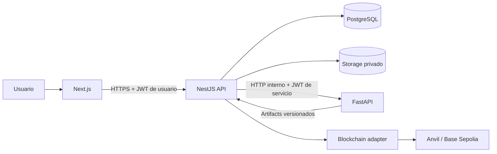
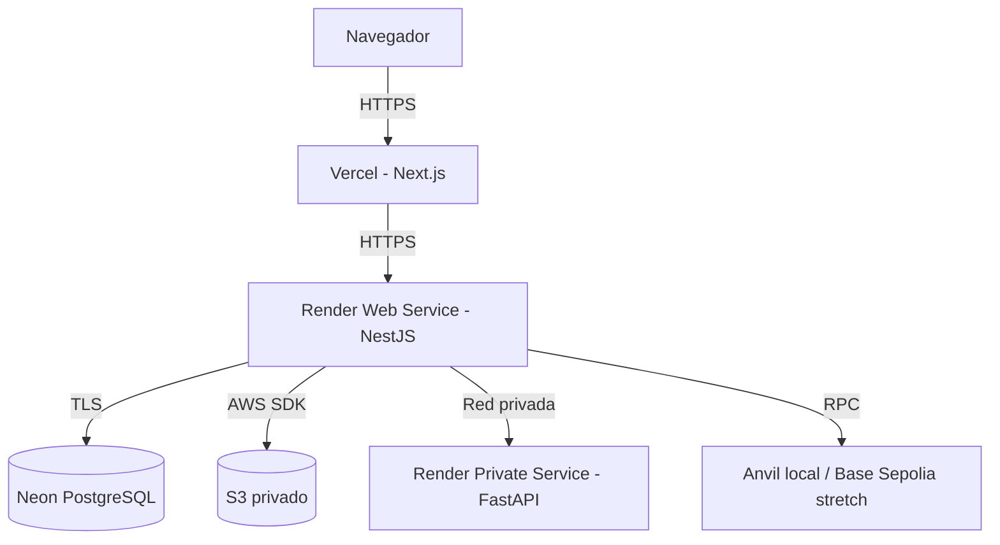
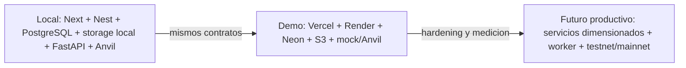

# Arquitectura de despliegue v0

## Proposito

Definir el despliegue recomendado para la demo/PFI de Traza sin cambiar la
arquitectura modular actual ni convertir decisiones futuras en estado
implementado.

## Decision

| Componente | Destino demo |
| --- | --- |
| Next.js | Vercel |
| NestJS | Render Web Service |
| FastAPI | Render Private Service |
| PostgreSQL | Neon |
| Evidencia documental | Amazon S3 privado |
| Blockchain local | `mock` o Anvil |
| Blockchain testnet | Base Sepolia, stretch posterior |
| Catalogo academico | pipeline offline de importacion |

NestJS conserva autenticacion, autorizacion, reglas de dominio, persistencia y
orquestacion. El navegador solo consume DTOs seguros de NestJS.

## Arquitectura logica

## Deployment recomendado

NestJS y FastAPI deben desplegarse en la misma region cuando Render lo permita.
Neon y S3 deben elegirse en regiones cercanas para reducir latencia y egress.

## Ambientes

La configuracion completa se detalla en
`environment-strategy-v0.md`. El despliegue no cambia los contratos publicos
existentes por si mismo.

## Alcance

- objetivo de despliegue para demo y staging;
- fronteras de red y responsabilidad;
- direccion para P4e-P4i;
- continuidad de modos blockchain locales.

## Fuera de alcance

- manifiestos ejecutables de Vercel, Render, Neon o AWS;
- provisionamiento, dominios o observabilidad productiva;
- Base Sepolia operativa;
- mainnet, MetaMask o firma desde frontend;
- separacion de NestJS en microservicios.

## Impacto en modulos actuales

- `apps/web` seguira usando `NEXT_PUBLIC_API_BASE_URL`;
- `services/api` seguira siendo la unica API publica de dominio;
- `DocumentStoragePort` permitira alternar local/S3;
- `AiServiceClient` apuntara al servicio privado;
- Prisma usara una URL PostgreSQL de Neon;
- blockchain conservara `mock` y Anvil como rutas garantizadas.

## Riesgos

- cold starts y memoria insuficiente en FastAPI;
- limites de conexiones Prisma/Neon;
- egress entre proveedores;
- CORS incorrecto entre Vercel y Render;
- secretos ausentes o expuestos;
- introducir Base Sepolia antes de idempotencia y reconciliacion.

## Proximos slices relacionados

P4e S3, P4f Neon, P4g Render API, P4h Vercel web, P4i FastAPI privado y P7
testnet.

