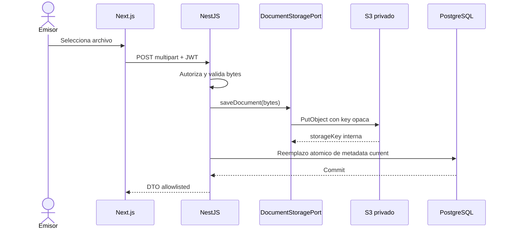

# Decision de storage documental v0

## Proposito

Definir como almacenar y recuperar evidencia documental sin exponer detalles de
infraestructura al navegador ni reemplazar el historial de dominio.

## Decision

Mantener `DocumentStoragePort`, conservar `LocalDocumentStorageAdapter` para
local y agregar `S3DocumentStorageAdapter` en P4e. El bucket sera privado, con
Block Public Access y permisos IAM minimos.

El port actual implementa `saveDocument()` y `deleteDocument()`. P5 necesitara
una capacidad interna de lectura, preferentemente `openDocumentStream()` o una
alternativa equivalente. Esa ampliacion no se implementa en P4d.

## Upload documental

Si falla PostgreSQL despues de guardar el objeto, el backend debe conservar la
compensacion de borrado. Un reconciliador de objetos huerfanos es hardening
posterior.

## Politica S3

- bucket no publico y Block Public Access habilitado;
- ACLs deshabilitadas;
- IAM restringido al bucket/prefijo y acciones necesarias;
- cifrado server-side administrado por S3 inicialmente;
- keys aleatorias, sin email, nombre del holder ni titulo de credencial;
- versioning recomendado para una demo estable;
- lifecycle opcional para versiones operativas antiguas;
- sin CORS de bucket para el navegador en este flujo.

`DocumentEvidence` conserva `storageProvider` y `storageKey` internamente. El
frontend no recibe esos campos ni conoce path, bucket o proveedor.

## Acceso temporal

Las presigned URLs quedan como evolucion futura de lectura controlada. No se
usaran para upload desde frontend ni para entregar documentos a FastAPI en P5
inicial. Deben tratarse como bearer tokens, con expiracion corta y sin logs.

## Alcance

- adapter local y S3 intercambiables;
- upload siempre Web -> NestJS -> port;
- privacidad, naming, IAM y compensacion;
- lectura interna futura para analisis.

## Fuera de alcance

- descarga o preview publico;
- upload directo del navegador;
- Firebase, GCS o Azure operativos;
- migracion de objetos existentes;
- reconciliador y lifecycle automatizados.

## Impacto en modulos actuales

`document-evidence` mantiene endpoints y DTOs. P4e agregara configuracion y el
adapter S3 sin modificar el frontend. P5a ampliara el port para lectura interna.

## Riesgos

- objetos huerfanos por falta de transaccion distribuida;
- IAM excesivo;
- path traversal en adapter local;
- egress S3-Render;
- logs con keys o URLs temporales;
- confundir S3 Versioning con historial `DocumentEvidence`.

## Proximos slices relacionados

P4e adapter S3, P5a lectura interna y P5c analisis documental.

