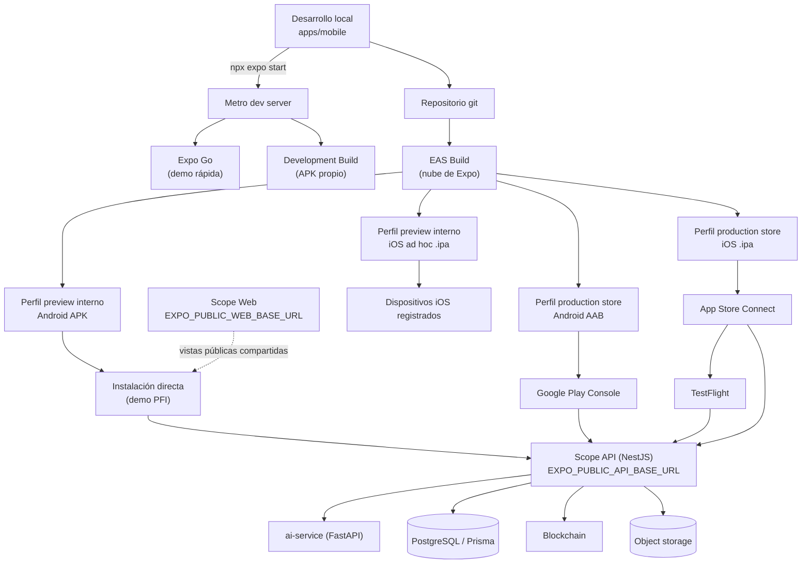

# Plan de deployment

> **Estado de la nube:** ninguna acción remota fue ejecutada. No hay cuenta EAS
> creada, ni `eas init`, ni builds, ni envíos a tiendas, ni updates OTA.
> `eas.json` está listo para usarse; los comandos de abajo son los que hay que
> correr, no los que se corrieron.

---

## A. Arquitectura de entrega



La app **sólo** habla con Scope API. Scope Web aparece únicamente como destino de
los enlaces públicos que el titular comparte.

---

## B. Entornos

| Entorno | `EXPO_PUBLIC_API_BASE_URL` | `EXPO_PUBLIC_WEB_BASE_URL` | Artefacto |
| --- | --- | --- | --- |
| Local — emulador Android | `http://10.0.2.2:3001` | `http://10.0.2.2:3000` | Expo Go / dev build |
| Local — simulador iOS | `http://127.0.0.1:3001` | `http://127.0.0.1:3000` | Expo Go / dev build |
| Local — teléfono físico | `http://<IP-LAN>:3001` | `http://<IP-LAN>:3000` | Expo Go / dev build |
| Preview / demo PFI | `https://<host-api>` | `https://<host-web>` | **APK** |
| Producción | `https://<host-api>` | `https://<host-web>` | AAB / IPA |

`10.0.2.2` es la dirección con la que el emulador de Android ve el `localhost` de
la máquina anfitriona. **Un teléfono físico no puede usar `localhost`**: necesita
la IP LAN de la computadora, y ambas tienen que estar en la misma red.

Producción **debe** usar `https://`. Android bloquea el tráfico en claro por
defecto desde API 28.

---

## C. Desarrollo local

```bash
cd apps/mobile && cp .env.example .env
```

Editar `.env` con las URLs del entorno, y después:

```bash
cd apps/mobile && npm start
```

Metro muestra un QR. Desde ahí: `a` abre el emulador Android, `i` el simulador
iOS, `r` recarga, `j` abre el depurador.

> Si cambiás `.env`, reiniciá Metro con la caché limpia: las variables
> `EXPO_PUBLIC_*` se embeben en tiempo de bundling.

```bash
cd apps/mobile && npx expo start --clear
```

---

## D. Teléfono Android físico

### Dos conexiones, dos diagnósticos

`Cannot connect to Expo CLI` corresponde a **teléfono → Metro**. Usar `npm
start` en la misma Wi-Fi, o `npm run start:tunnel` cuando LAN/firewall no sea
viable. El tunnel no cambia la API de Scope.

`Scope tardó demasiado en responder` corresponde a **app → API**. Revisar
`EXPO_PUBLIC_API_BASE_URL` y ejecutar `npm run check:api`; un `401` de
`/auth/me` sin token confirma alcance. La app desplegada llama al API público
por HTTPS directamente, sin CORS de navegador.

En Windows, `npm run start:tunnel` resuelve `@expo/ngrok` global. Si Expo falla
por un emulador offline, ejecutar `adb kill-server` y volver a abrir sólo los
dispositivos reales antes de iniciar Metro.

1. Instalar **Expo Go** desde Play Store.
2. Averiguar la IP LAN de la computadora (`ipconfig` en Windows).
3. Poner esa IP en `.env`:
   `EXPO_PUBLIC_API_BASE_URL=http://192.168.0.10:3001`
4. Levantar el backend escuchando en `0.0.0.0`, no sólo en `127.0.0.1`.
5. Permitir el puerto en el firewall de Windows.
6. `npm start` y escanear el QR con Expo Go.

Requisito: teléfono y computadora en la **misma red Wi-Fi**.

---

## E. Emulador Android

Con Android Studio instalado y un AVD creado:

```bash
cd apps/mobile && npm run android
```

Usar `http://10.0.2.2:3001` como base del API.

---

## F. Simulador iOS

Sólo en macOS, con Xcode instalado:

```bash
cd apps/mobile && npm run ios
```

Usar `http://127.0.0.1:3001`.

---

## G. Compatibilidad con Expo Go

**Toda la app v1 funciona en Expo Go.** Ninguna dependencia requiere código
nativo fuera del cliente de Expo Go:

| Dependencia | ¿Expo Go? |
| --- | --- |
| `expo-router`, `expo-constants`, `expo-linking` | Sí |
| `expo-secure-store` | Sí |
| `expo-clipboard`, `expo-font`, `expo-splash-screen`, `expo-status-bar`, `expo-system-ui` | Sí |
| `@expo/vector-icons`, `@expo-google-fonts/inter` | Sí |
| `@tanstack/react-query` | Sí (JS puro) |
| `react-native-safe-area-context`, `react-native-screens`, `react-native-gesture-handler`, `react-native-reanimated` | Sí |

**Lo que Expo Go no puede mostrar:** el icono de app propio, la pantalla de
splash propia, el esquema `scope://` y el nombre "Scope" en el lanzador. Para
verlos hace falta un development build o un APK de preview.

**Ninguna decisión de seguridad se comprometió para preservar Expo Go.** Que
funcione ahí es una consecuencia afortunada, no un objetivo que haya condicionado
nada.

---

## H. Development Build

Necesario cuando se agregue una dependencia con código nativo que Expo Go no
incluya, o para probar icono, splash y deep links.

```bash
npm install --global eas-cli
```

```bash
cd apps/mobile && eas build --platform android --profile development
```

Instalar el APK resultante y levantar Metro con `npm start`.

---

## I. APK de preview — **el camino recomendado para el PFI**

Este es el objetivo principal de la sección `preview` de `eas.json`:
`android.buildType: "apk"` con `distribution: "internal"`. Un APK se instala
directamente en cualquier Android, sin Play Store y sin revisión.

### Paso a paso

**1. Instalar EAS CLI**

```bash
npm install --global eas-cli
```

**2. Iniciar sesión con la cuenta de Expo**

```bash
eas login
```

**3. Registrar el proyecto** (desde `apps/mobile`; escribe `extra.eas.projectId`
en `app.config.ts`)

```bash
cd apps/mobile && eas init
```

**4. Poner las URLs reales en `eas.json`**

Reemplazar los `"SET_ME"` del perfil `preview` por el API y la web públicos.
No son secretos: son configuración pública.

**5. Lanzar el build**

```bash
cd apps/mobile && eas build --platform android --profile preview
```

EAS genera y guarda el keystore de firma la primera vez. **No hay que crear ni
versionar ningún keystore.**

**6. Descargar e instalar**

Al terminar, EAS da una URL de descarga y un QR. En el teléfono hay que permitir
"Instalar apps de origen desconocido" para el navegador o el gestor de archivos.

**7. Probar contra el API desplegado**

Ejecutar la matriz manual de `09-testing-y-calidad.md`.

### Por qué este camino y no otro

| Alternativa | Problema |
| --- | --- |
| Play Store | Requiere cuenta de desarrollador (pago único), ficha de tienda, política de privacidad y revisión. Días de demora. |
| TestFlight | Requiere Apple Developer Program (USD 99/año) y revisión de TestFlight. |
| Expo Go | No muestra el icono ni el splash de Scope; se ve como "Expo". |
| Build local | Requiere Android Studio, JDK y SDK configurados en la máquina. |

El APK de preview evita todo eso: **un archivo, se instala, funciona**.

---

## J. Build local (alternativa sin nube)

Posible, pero con más requisitos previos.

```bash
cd apps/mobile && eas build --platform android --profile preview --local
```

Requiere: JDK 17, Android SDK con `ANDROID_HOME` configurado, NDK, y bastante
espacio en disco. En Windows conviene usar WSL2.

**Recomendación: no usar esta vía para la demo del PFI.** El build en la nube es
más simple y no depende de la configuración de la máquina.

---

## K. AAB para Play Store

Producción en Android **no** es un APK: Google Play exige un Android App Bundle.
El perfil `production` ya está configurado con `buildType: "app-bundle"`.

```bash
cd apps/mobile && eas build --platform android --profile production
```

```bash
cd apps/mobile && eas submit --platform android --profile production
```

Antes hay que: crear la cuenta de Google Play Console (USD 25, pago único),
crear la app, confirmar el `package` definitivo, preparar la ficha (descripción,
capturas, icono de 512×512, gráfico destacado de 1024×500), completar el
cuestionario de seguridad de datos y publicar una política de privacidad.

Ruta sugerida: **prueba interna → prueba cerrada → producción**.

---

## L. iOS: distribución interna y TestFlight

### Distribución interna (ad hoc)

El perfil `preview` usa `distribution: "internal"`. En iOS genera una IPA con
provisionamiento **ad hoc** para dispositivos registrados; se instala desde el
enlace de EAS y **no** se puede subir a TestFlight.

```bash
cd apps/mobile && eas build --platform ios --profile preview
```

Requiere una cuenta Apple Developer y registrar previamente los UDID de los
dispositivos de prueba. Es útil para pruebas directas en un conjunto acotado de
dispositivos, pero no equivale al testing interno de TestFlight.

### TestFlight

TestFlight requiere una build con distribución `store`. El perfil `production`
ya expresa esa configuración por omisión; no se debe usar `preview`.

```bash
cd apps/mobile && eas build --platform ios --profile production
```

```bash
cd apps/mobile && eas submit --platform ios --profile production
```

Requiere Apple Developer Program (USD 99/año), el bundle identifier registrado y
una app creada en App Store Connect. EAS puede administrar certificados y
perfiles de aprovisionamiento por su cuenta.

Tras subir la build de producción, Apple la procesa y aparece en TestFlight. Las
pruebas internas del equipo de App Store Connect no requieren la revisión beta
externa; las externas sí pueden requerirla.

**iOS no tiene equivalente al sideload de un APK.** Cualquier afirmación de que
instalar en iPhone es tan simple como en Android es falsa.

---

## M. App Store

```bash
cd apps/mobile && eas build --platform ios --profile production
```

```bash
cd apps/mobile && eas submit --platform ios --profile production
```

La misma build de producción puede usarse primero en TestFlight. Para publicarla
después: completar la ficha en App Store Connect, responder el cuestionario de
privacidad, enviar a revisión (típicamente 1-3 días) y publicar.

---

## N. Firma y credenciales

| Plataforma | Qué se necesita | Quién lo administra |
| --- | --- | --- |
| Android | Keystore de subida | **EAS**, generado en el primer build. |
| Android | Clave de firma de la app | Google Play App Signing. |
| iOS | Certificado de distribución | **EAS**. |
| iOS | Perfil de aprovisionamiento | **EAS**. |
| iOS | Clave de API de App Store Connect | Se crea en App Store Connect para `eas submit`. |

**Nada de esto se versiona.** El `.gitignore` de `apps/mobile` excluye
explícitamente `*.jks`, `*.keystore`, `*.p8`, `*.p12`, `*.key` y
`*.mobileprovision`.

Para ver o exportar credenciales:

```bash
cd apps/mobile && eas credentials
```

---

## O. Versionado

| Campo | Dónde | Valor inicial | Cuándo se incrementa |
| --- | --- | --- | --- |
| `version` | `app.config.ts` | `0.1.0` | Semver, por release de producto. |
| `android.versionCode` | `app.config.ts` | `1` | **Entero, siempre creciente**, en cada subida a Play. |
| `ios.buildNumber` | `app.config.ts` | `"1"` | Siempre creciente, en cada subida a App Store. |

`eas.json` usa `appVersionSource: "local"`: los números salen de
`app.config.ts` y quedan a la vista en el repositorio.

Alternativa futura: `"remote"` + `autoIncrement: true` en el perfil de
producción, para que EAS lleve la cuenta. Requiere el proyecto ya registrado.

Estos números **no** tienen relación con las versiones de `apps/web` ni de
`services/api`.

---

## P. Variables de entorno

Tres formas, en orden de preferencia:

1. **`eas.json`** → el bloque `env` de cada perfil. Es lo que ya está preparado
   (con `"SET_ME"` como marcador obligatorio de reemplazo).
2. **Variables de entorno de EAS** → `eas env:create`, útil para no versionar
   la URL de producción.
3. **`.env` local** → sólo desarrollo. Está en `.gitignore`.

**Todo lo que empieza con `EXPO_PUBLIC_` queda embebido en el bundle y es legible
por cualquiera que tenga el APK.** Es configuración pública, no secreto.

---

## Q. Secretos

**La app móvil no contiene ningún secreto y no debe contenerlo nunca.**

Prohibido en `app.config.ts`, `eas.json`, `package.json` y `.env.example`:
`JWT_SECRET`, `ISSUER_PRIVATE_KEY`, `DATABASE_URL`, claves de proveedores de IA,
credenciales de storage, claves de API de terceros.

Todo eso vive en el backend. La app sólo tiene URLs públicas y el JWT del
titular, que es efímero y se guarda en el almacenamiento seguro del sistema.

---

## R. Entorno de API

La app apunta a donde diga `EXPO_PUBLIC_API_BASE_URL`. **Cambiar de proveedor de
hosting no requiere tocar una sola línea de código de pantalla.**

Requisitos del backend para que la app funcione:

- HTTPS en producción (Android bloquea tráfico en claro);
- accesible desde internet (o desde la LAN, en desarrollo);
- CORS **no aplica**: una app nativa no está sujeta a CORS.

---

## S. Configuración del proyecto EAS

Estado actual: `eas.json` existe y es válido; `extra.eas.projectId` está
**deliberadamente vacío** — no se inventó un identificador.

Para completarlo:

```bash
cd apps/mobile && eas init
```

---

## T. CI/CD futuro

El repositorio no tiene hoy un pipeline que extender. Recomendación:

~~~
Pull request
  └─ npm ci
     ├─ apps/mobile: npm run typecheck
     ├─ apps/mobile: npm run lint
     ├─ apps/mobile: npm test
     └─ apps/mobile: npm run doctor

Merge a main
  └─ eas build --platform android --profile preview --non-interactive

Tag de release (v*)
  ├─ eas build --platform android --profile production
  ├─ eas build --platform ios --profile production
  └─ eas submit (manual o automático)
~~~

Secretos de CI: `EXPO_TOKEN` (token robot de Expo) como secreto del proveedor de
CI. **Nunca** en el repositorio.

---

## U. Updates OTA

`expo-updates` **no está instalado**. Es deliberado: configurar canales de update
antes de que exista un proyecto EAS sería inventar infraestructura.

Cuando se decida adoptarlo:

```bash
cd apps/mobile && npx expo install expo-updates
```

| Cambio | ¿Se puede por OTA? |
| --- | --- |
| Código JS / TS | Sí |
| Estilos y layout | Sí |
| Copy | Sí |
| Imágenes empaquetadas | Sí |
| Dependencia nativa nueva | **No** — requiere binario nuevo |
| Cambio de SDK de Expo | **No** |
| Icono, splash, permisos, esquema | **No** |
| `versionCode` / `buildNumber` | **No** |

**Riesgo:** un OTA defectuoso llega a todos los dispositivos sin pasar por
revisión de tienda. Mitigación: publicar primero en un canal de preview y hacer
rollout gradual.

---

## V. Rollback

| Situación | Cómo se revierte |
| --- | --- |
| OTA defectuoso | `eas update:rollback` o republicar el update anterior. Minutos. |
| Binario defectuoso en Play | Detener el despliegue y volver a la versión previa en Play Console. |
| Binario defectuoso en App Store | Quitar de la venta y enviar una corrección (requiere revisión). |
| APK de preview defectuoso | Distribuir el APK anterior. |

**Un cambio nativo defectuoso no se puede revertir por OTA.** Por eso conviene
que la mayor parte de los cambios sean de JS.

---

## W. Recomendación para la demo del PFI

**Camino recomendado: APK de preview generado con EAS Build en la nube.**

~~~
1. Desplegar el backend con HTTPS accesible desde internet.
2. Desplegar Scope Web con HTTPS (para los enlaces compartidos).
3. npm install --global eas-cli
4. eas login
5. cd apps/mobile && eas init
6. Reemplazar los "SET_ME" del perfil `preview` en eas.json.
7. eas build --platform android --profile preview
8. Descargar el APK desde el enlace de EAS.
9. Instalarlo en el Android de la demo.
10. Ejecutar la matriz manual de 09-testing-y-calidad.md.
~~~

**Por qué:** no requiere Play Store, ni cuenta de Apple, ni Android Studio, ni
que la máquina de la demo tenga nada instalado. Es un archivo que se instala.

**Plan B si no hay cuenta de EAS:** Expo Go contra el backend por LAN. Funciona
completo, pero se ve como "Expo" en vez de "Scope" (sin icono ni splash propios).

### Qué alcanza para el PFI

- App nativa funcional contra el API real
- Login, perfil, credenciales, detalle, compartir, actualizar, logout
- APK instalable
- Entorno de demo estable

### Qué NO hace falta para el PFI

Publicación en tiendas, cuenta de Apple, política de privacidad publicada,
monitoreo de errores, analítica, updates OTA, CI/CD.

---

## X. Checklist de endurecimiento para producción

**PFI-ready ≠ production-ready.** Antes de una publicación real:

### Identidad y tienda

- [ ] **Confirmar el bundle identifier / package.** Hoy es `com.scope.holder`,
      marcado como **PROVISIONAL** en `app.config.ts`. Cambiarlo después de
      publicar es imposible sin crear una app nueva.
- [ ] Registrar la cuenta de Google Play Console.
- [ ] Registrar el Apple Developer Program.
- [ ] Preparar la ficha de tienda (descripción, capturas, icono 512×512).
- [ ] Publicar una política de privacidad en una URL estable.
- [ ] Publicar una URL de soporte.
- [ ] Completar el cuestionario de seguridad de datos de Play.
- [ ] Completar las etiquetas de privacidad de App Store.

### Declaración de datos (para los cuestionarios)

| Categoría | ¿Se recolecta? | Uso |
| --- | --- | --- |
| Correo electrónico | Sí, ingresado por la persona | Autenticación. |
| Contraseña | Sí, en tránsito | Autenticación. **Nunca se persiste.** |
| Datos formativos (credenciales, perfil) | Sí, del backend | Funcionalidad de la app. |
| Identificadores del dispositivo | No | — |
| Ubicación | No | — |
| Contactos, cámara, fotos, micrófono | No | La app no pide **ningún** permiso. |
| Analítica de uso | No | Ninguna SDK instalada. |
| Publicidad | No | — |

Confirmar estas respuestas con el backend antes de enviarlas: son declaraciones
legales.

### Técnico

- [ ] Confirmar HTTPS en la API de producción.
- [ ] Decidir si se adopta monitoreo de errores (Sentry u otro) — hoy **no** hay.
- [ ] Decidir si se adopta analítica — hoy **no** hay.
- [ ] Evaluar `expo-updates` para poder corregir sin pasar por tienda.
- [ ] Resolver la vida del JWT (1 h sin refresh) — ver `11-brechas`.
- [ ] QA en dispositivos Android reales de gamas distintas.
- [ ] QA en dispositivos iOS reales.
- [ ] Pasada de accesibilidad con TalkBack y VoiceOver.
- [ ] Revisión de seguridad del bundle publicado (verificar que no haya secretos).
- [ ] Probar el comportamiento con muchas credenciales.
- [ ] Separación real entre el entorno de preview y el de producción.
- [ ] Definir versionado y proceso de release.
- [ ] Configurar CI.
